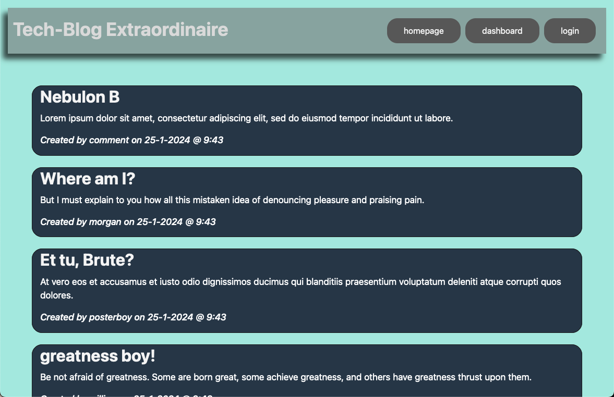

# Tech-Blog

## Description
An interactive blogging website that allows users to post blogs and comment on fellow blogs, with a login system locking out unauthorized users.

### Installation
[Deployed Through Heroku](https://heroku.com)

### Usage
 - From the homepage, a user can click 'login' to either log in to their account or sign up for an account.  Passwords are encrypted through the bcrypt NPM library.
 - Upon authentication, the user is taken to their 'dashboard' where all of their saved blog posts are listed.
 - Clicking on a blog post will bring it up in a new view, and allow either the deletion of the blog post, or commenting on the blog post.  All previous comments from other users will also be displayed.

Homepage 
  
Dashboard 
  
Blog Post 
  

#### Credits
NPM Libraries:
 - [bcrypt](https://www.npmjs.com/package/bcrypt)
 - [dotenv](https://www.npmjs.com/package/dotenv)
 - [express](https://expressjs.com/)
 - [express-handlebars](https://www.npmjs.com/package/express-handlebars)
 - [mysql2](https://www.npmjs.com/package/mysql2)
 - [sequelize](https://www.npmjs.com/package/sequelize)

#### License
No license provided.